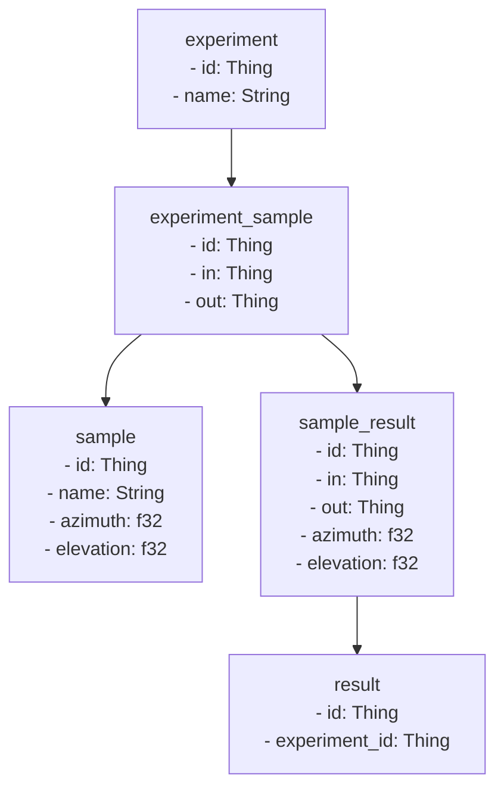

# Database schema

```mermaid
flowchart TD
    experiment[
        experiment
        - id: Thing
        - name: String
    ]
    sample[
        sample
        - id: Thing
        - name: String
        - azimuth: f32
        - elevation: f32
    ]
    result[
        result
        - id: Thing
        - experiment_id: Thing
    ]
    experiment_sample[
        experiment_sample
        - id: Thing
        - in: Thing
        - out: Thing
    ]
    sample_result[
        sample_result
        - id: Thing
        - in: Thing
        - out: Thing
        - azimuth: f32
        - elevation: f32
    ]

    experiment --> experiment_sample
    experiment_sample --> sample
    experiment_sample --> sample_result
    sample_result --> result
```

`Thing = Table + Id`
